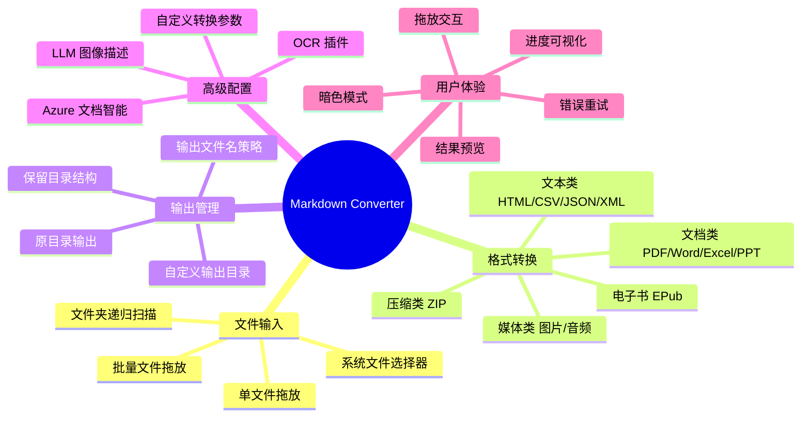
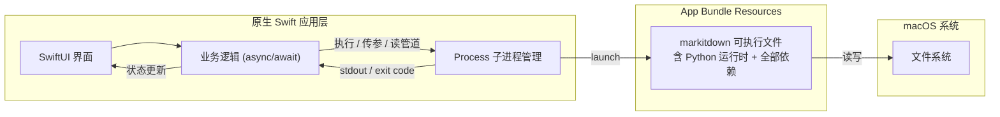
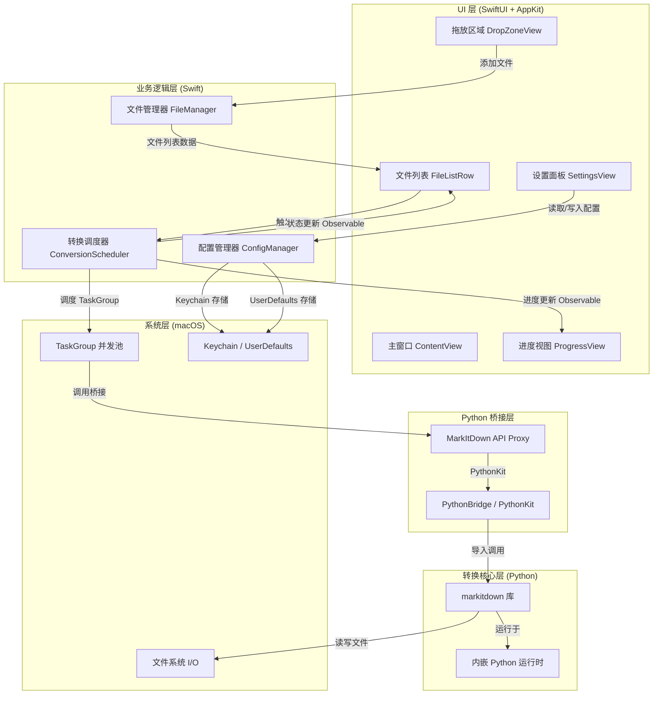
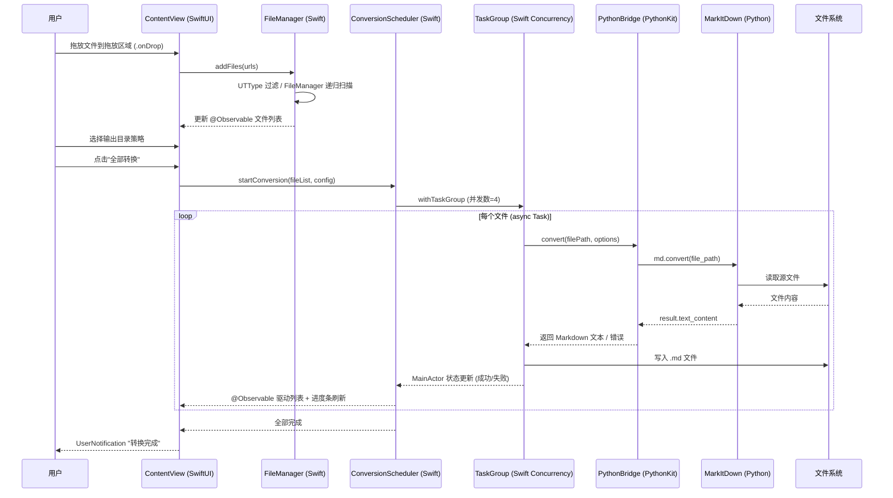
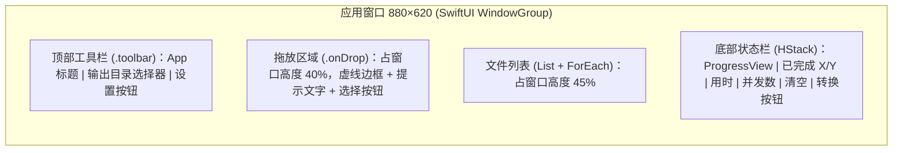

### **基于 MarkItDown 的 macOS 原生文件转 Markdown 小工具 PRD 文档**

一个以 Swift 打造的原生 macOS 桌面应用，内嵌 MarkItDown 转换内核，支持将 PDF、Word、Excel、PowerPoint、图片、音频等十余种文件格式一键或批量转换为 Markdown 文件。

---

## **一、文档信息**

| 项目 | 内容 |
|------|------|
| 产品名称 | MarkItDown|
| 文档版本 | V2.0 |
| 编写日期 | 2026-06-29 |
| 文档性质 | 产品需求文档（PRD） |
| 依赖核心库 | [microsoft/markitdown](https://github.com/microsoft/markitdown) v0.1.6+ |
| 目标平台 | macOS 13 Ventura 及以上 |
| 开发语言 | Swift 5.9+（SwiftUI + AppKit） |
| 转换内核 | MarkItDown（Python，以独立可执行文件形式内嵌） |

---

## **二、产品背景与目标**

### **2.1 背景分析**

MarkItDown 是由 Microsoft 开源维护的轻量级 Python 工具，能够将多种文件格式（PDF、Word、Excel、PowerPoint、图片、音频、HTML、CSV、JSON、XML、ZIP、YouTube 链接、EPub 等）转换为 Markdown，同时保留标题、列表、表格、链接等重要文档结构。该库在 GitHub 上已获得 161k stars，是目前 LLM 文本预处理领域最受欢迎的开源工具之一。

然而，MarkItDown 本身仅提供命令行（CLI）和 Python API 两种使用方式，对非技术用户而言门槛较高。本产品旨在以原生 Swift 应用为外壳，将 MarkItDown 的转换能力封装为一个美观、简洁、开箱即用的 macOS 桌面应用，让任何用户都能通过拖拽文件即可完成格式转换。

与跨平台 GUI 方案相比，采用 Swift + SwiftUI 开发能获得真正的原生体验：系统级毛玻璃材质、原生菜单栏、Drag and Drop 协议、SF Symbols 图标体系、Keychain 安全存储、Universal Binary 双架构支持等均为 macOS 一等公民能力，体积更小、启动更快、交互更贴合系统习惯。

### **2.2 产品目标**

**核心目标：** 将 MarkItDown 的文件转换能力以最低认知成本交付给 macOS 用户，同时提供纯正的 macOS 原生体验。

具体目标分解如下：

- **零配置开箱即用：** 用户无需安装 Python、无需配置环境。应用将 MarkItDown 及其全部依赖预先打包为一个独立命令行可执行文件，嵌入 App Bundle 的 Resources 目录，Swift 通过 `Process` 调用，实现真正的"绿色版"分发。
- **极致简洁的操作体验：** 核心交互链路不超过三步——拖入文件 → 选择输出目录 → 点击转换。批量场景下，用户可一次拖入数十个文件，应用自动识别格式并通过 Swift Concurrency 并行处理。
- **原生 macOS 视觉与交互：** 应用采用 SwiftUI 构建界面，配合 AppKit 补足原生能力。深度适配 macOS 设计语言，包括毛玻璃材质（`.regularMaterial`）、原生窗口标题栏、系统级拖放、SF Symbols 图标、Dark Mode 自动跟随，让用户感受不到任何"跨平台移植"痕迹。
- **完整覆盖 MarkItDown 能力：** 保留 MarkItDown 支持的全部格式与高级特性（LLM 图像描述、OCR 插件、Azure Document Intelligence 等），通过设置面板提供可选的高级配置入口。

### **2.3 非目标（V1.0 不做）**

- 不做 Windows / Linux 版本（V1.0 聚焦 macOS 平台）
- 不做在线 SaaS 服务，纯本地运行
- 不做 Markdown 文件的内容编辑功能（本工具定位为"转换器"而非"编辑器"）
- 不做 YouTube URL 转录功能（需要网络请求及额外依赖，V1.0 暂不纳入核心流程，可在设置面板预留入口）

---

## **三、目标用户**

### **3.1 用户画像**

**画像 A：内容创作者 / 知识管理爱好者**
- 经常需要将 PDF 论文、Word 文档、PPT 课件整理进 Obsidian / Notion 等笔记工具
- 痛点：手动复制粘贴丢失格式，在线转换工具有隐私顾虑且限制文件大小
- 期望：拖入文件即可得到格式清晰的 Markdown，直接导入笔记库

**画像 B：LLM 应用开发者 / 数据工程师**
- 需要为 RAG（检索增强生成）管道预处理大量异构文档
- 痛点：虽然能使用 MarkItDown CLI，但批量化操作时命令行参数管理繁琐，进度不可视
- 期望：批量导入文件夹，可视化查看转换进度与结果，快速定位失败文件

**画像 C：非技术办公人员**
- 偶尔需要将 Excel 表格、PPT 内容转为文本用于邮件或汇报
- 痛点：完全不会使用命令行工具
- 期望：像使用"格式转换器"一样简单，双击打开、拖入文件、得到结果

### **3.2 用户场景**

**场景一（单文件快速转换）：** 用户在 Finder 中选中一份 PDF 论文，拖入 App 窗口，App 自动在文件同目录下生成同名 `.md` 文件，并弹出系统通知提示转换完成。用户打开 `.md` 文件查看，发现标题层级、段落、参考文献链接均完整保留。

**场景二（批量文件夹转换）：** 用户将整个项目文件夹拖入 App，App 自动递归扫描所有支持的文件类型（PDF、DOCX、XLSX、PPTX 等），在列表中展示每个文件的转换状态。用户选择"保留原目录结构"输出到指定文件夹，点击"全部转换"后可看到实时进度条。转换完成后，用户获得一个结构完整的 Markdown 文件集，可直接用于 RAG 知识库构建。

**场景三（图片 OCR 转换）：** 用户拖入一张含大量文字的截图，在设置中开启"LLM 图像描述 / OCR"选项并填入 OpenAI API Key，App 调用 GPT-4o 对图片内容进行识别与描述，输出包含文字提取结果和内容描述的 Markdown 文件。

---

## **四、核心功能需求**

### **4.1 功能架构总览**



### **4.2 功能清单与优先级**

| 编号 | 功能模块 | 功能描述 | 优先级 |
|------|----------|----------|--------|
| F-01 | 文件拖放导入 | 支持从 Finder 拖放单文件/多文件/文件夹到 App 窗口 | P0 |
| F-02 | 文件选择器导入 | 通过原生 NSOpenPanel 选择文件或文件夹 | P0 |
| F-03 | 格式自动识别 | 根据文件扩展名自动匹配对应的 MarkItDown 转换器 | P0 |
| F-04 | 单文件转换 | 对单个文件执行 MarkItDown 转换并输出 .md | P0 |
| F-05 | 批量转换 | 对多个文件通过 Swift Concurrency 并行执行转换 | P0 |
| F-06 | 输出目录选择 | 支持原目录输出或自定义输出目录 | P0 |
| F-07 | 转换进度展示 | 列表式展示每个文件的转换状态与整体进度条 | P0 |
| F-08 | 结果预览 | 转换完成后可在 App 内预览 Markdown 渲染效果 | P1 |
| F-09 | 在 Finder 中显示 | 转换完成后右键菜单"在 Finder 中显示"定位文件 | P1 |
| F-10 | LLM 图像描述 | 配置 OpenAI API Key，对图片文件生成内容描述 | P1 |
| F-11 | OCR 插件支持 | 启用 markitdown-ocr 插件，对文档内嵌图片做 OCR | P2 |
| F-12 | Azure 文档智能 | 配置 Azure Document Intelligence 端点进行高质量转换 | P2 |
| F-13 | 保留目录结构 | 批量转换时在输出目录中重建原始文件夹层级 | P1 |
| F-14 | 失败重试 | 对转换失败的文件提供单独重试按钮 | P1 |
| F-15 | 偏好设置持久化 | 记住用户上次选择的输出目录、高级配置等 | P1 |
| F-16 | 拖放区域交互反馈 | 拖入文件时区域高亮、动画反馈 | P1 |
| F-17 | 格式过滤提示 | 拖入不支持的格式时给出友好提示 | P1 |
| F-18 | 打开输出文件夹 | 转换完成后一键打开输出目录 | P0 |
| F-19 | 清空列表 | 清空当前文件列表，准备下一批转换 | P0 |
| F-20 | 暗色模式 | 自动跟随系统暗色/亮色主题 | P1 |

### **4.3 P0 核心功能详细规格**

#### **F-01 / F-02：文件导入**

应用主界面中心区域为一个大尺寸的拖放区域，同时支持以下两种导入方式：

**拖放导入：** 用户从 Finder 直接拖拽文件（单个或多个）或文件夹到拖放区域。拖放区域通过 SwiftUI 的 `.onDrop(of:isTargeted:perform:)` 修饰符接收 `UTType.file` 类型的拖入项，配合 `isTargeted` 回调在文件悬停时呈现高亮边框与半透明覆盖层动画，提示"松开以添加文件"。若拖入的是文件夹，App 通过 `FileManager.enumerator` 递归扫描其中所有受支持格式的文件并加入待转换列表。若拖入的文件格式不被支持，该文件不加入列表，同时在界面底部以 Toast 提示"已跳过 N 个不支持的文件"。

**选择器导入：** 拖放区域中央设有"选择文件"和"选择文件夹"两个按钮，点击后调用 macOS 原生 `NSOpenPanel`（通过 AppKit 桥接）。文件对话框 `allowedContentTypes` 涵盖 MarkItDown 支持的全部格式：`.pdf .docx .doc .pptx .ppt .xlsx .xls .csv .json .xml .html .htm .jpg .jpeg .png .gif .bmp .tiff .wav .mp3 .epub .zip .msg .eml`。

#### **F-04 / F-05：格式转换**

转换逻辑由内嵌的 MarkItDown 可执行文件承担，Swift 层通过 `Process`（即 `NSTask`）以子进程方式调用。核心调用模式为：Swift 将待转换文件路径作为参数传递给内嵌可执行文件，通过 stdout 管道读取转换后的 Markdown 文本，或通过 `-o` 参数直接写入输出文件。

```swift
// Swift 层调用内嵌 MarkItDown 内核的核心模式
func convert(file: URL, output: URL?) async throws -> String {
    let process = Process()
    // 可执行文件位于 Bundle Resources
    let toolURL = Bundle.main.url(forResource: "markitdown", withExtension: nil)!
    process.executableURL = toolURL
    var args = [file.path]
    if let output { args += ["-o", output.path] }
    process.arguments = args

    let pipe = Pipe()
    process.standardOutput = pipe
    process.standardError = Pipe()

    try process.run()
    // 通过 async 序列化读取 stdout，转换完成后返回文本
    let data = pipe.fileHandleForReading.readDataToEndOfFile()
    process.waitUntilExit()
    return String(data: data, encoding: .utf8) ?? ""
}
```

**单文件转换：** 用户添加文件后，设置输出目录，点击"转换"按钮。App 在 `Task` 中异步调用上述转换函数，避免阻塞 UI 主线程。转换完成后将结果写入输出目录下的 `.md` 文件（文件名与原文件相同，扩展名替换为 `.md`）。

**批量转换：** 当列表中存在多个文件时，App 采用 Swift Concurrency 的 `TaskGroup` 并行执行转换（默认并发数 4，通过 `Semaphore` 或自定义并发限制控制，可在设置中调整）。每个文件的转换状态通过 `@Published` 属性实时更新到 SwiftUI 视图，顶部进度条显示整体完成百分比。

#### **F-06 / F-13：输出目录管理**

输出目录提供三种策略供用户选择：

- **原目录输出（默认）：** 生成的 `.md` 文件与源文件位于同一目录。
- **自定义目录：** 用户通过 `NSOpenPanel` 选择一个输出文件夹，所有 `.md` 文件输出到该目录下。
- **自定义目录 + 保留结构：** 输出到自定义目录的同时，按源文件的相对路径重建文件夹层级。例如源文件为 `~/Documents/project/report.pdf`，选择输出目录为 `~/Desktop/output/`，则生成的文件为 `~/Desktop/output/project/report.md`。

#### **F-07：转换进度展示**

文件列表以 SwiftUI `List` 形式呈现，每行包含：文件名、格式类型、文件大小、状态、操作。状态列显示以下几种状态：

| 状态 | 图标 | 说明 |
|------|------|------|
| 待转换 | 灰色圆点（SF Symbol `circle`） | 已加入列表但尚未开始转换 |
| 转换中 | 蓝色旋转动画（SF Symbol `progress.indicator`） | 正在执行 MarkItDown 转换 |
| 已完成 | 绿色对勾（SF Symbol `checkmark.circle.fill`） | 转换成功，.md 文件已生成 |
| 失败 | 红色叉号（SF Symbol `xmark.circle.fill`） | 转换失败，鼠标悬停显示错误信息 |

顶部 `ProgressView` 显示"已完成 X / Y"，配合百分比进度条。底部状态栏显示当前并发数、已用时长、预计剩余时间。

#### **F-18 / F-19：结果操作与列表管理**

转换完成后，每行右侧的操作区提供以下按钮（鼠标悬停时显示）：

- **在 Finder 中显示：** 调用 `NSWorkspace.shared.activateFileViewerSelecting([url])` 打开 Finder 并高亮生成的 `.md` 文件
- **预览：** 在 App 内弹窗预览 Markdown 渲染效果（P1 功能，使用原生 `WKWebView` 或 Markdown 解析渲染）
- **重试：** 仅对失败状态文件显示，重新执行转换

底部工具栏提供"清空列表"按钮，清空所有文件并重置进度。若存在正在转换的任务，先弹出确认对话框（`NSAlert`）。

---

## **五、支持的文件格式**

以下格式完全基于 MarkItDown 库的原生支持能力，应用不做任何格式限制：

| 类别 | 格式 | 扩展名 | 依赖说明 |
|------|------|--------|----------|
| 文档 | PDF | `.pdf` | 内置 pdfminer |
| 文档 | Word | `.docx` | 内置 python-docx |
| 文档 | PowerPoint | `.pptx` | 内置 python-pptx |
| 表格 | Excel | `.xlsx` | 内置 openpyxl |
| 表格 | 旧版 Excel | `.xls` | 需安装 `[xls]` 扩展 |
| 表格 | CSV | `.csv` | 内置 |
| 数据 | JSON | `.json` | 内置 |
| 数据 | XML | `.xml` | 内置 |
| 网页 | HTML | `.html .htm` | 内置 |
| 图片 | JPEG/PNG/GIF/BMP/TIFF | `.jpg .jpeg .png .gif .bmp .tiff` | EXIF 元数据 + 可选 LLM 描述 |
| 音频 | WAV/MP3 | `.wav .mp3` | 需安装 `[audio-transcription]` |
| 电子书 | EPub | `.epub` | 内置 |
| 压缩包 | ZIP | `.zip` | 内置，遍历包内文件逐一转换 |
| 邮件 | Outlook | `.msg .eml` | 需安装 `[outlook]` |

---

## **六、技术方案**

### **6.1 技术选型**

**GUI 框架：SwiftUI + AppKit**

选择 SwiftUI 作为主界面框架，配合 AppKit 补足底层原生能力。SwiftUI 是 Apple 官方推荐的现代声明式 UI 框架，在 macOS 13+ 上已高度成熟，支持原生动画、`@AppStorage` 状态持久化、`ProgressView`、`List` 等全部所需组件。对于 SwiftUI 尚未完全覆盖的系统级能力（如 `NSOpenPanel` 文件选择器、`NSWorkspace` Finder 调用、`NSItemProvider` 高级拖放），通过 AppKit 桥接实现。整体应用体验为 100% 原生 macOS 风格，无任何跨平台移植痕迹。

**转换核心：MarkItDown 内核（PyInstaller 预编译嵌入）**

MarkItDown 是 Python 库，无法被 Swift 直接 import。本方案采用"原生壳 + Python 内核"的混合架构：使用 PyInstaller 将 MarkItDown 及全部依赖（`markitdown[all]`）预编译为一个独立的命令行可执行文件（`--onefile` 模式），该可执行文件内含完整的 Python 运行时，无需用户环境中有 Python。编译产物嵌入 Swift 应用的 App Bundle `Contents/Resources/` 目录，Swift 层通过 `Process` 以子进程方式调用，通过命令行参数传递文件路径、通过 stdout 管道或 `-o` 参数获取转换结果。

这种架构确保 MarkItDown 的全部能力原封不动地保留，且 MarkItDown 版本升级时只需重新编译可执行文件并替换 Bundle 内资源，无需改动 Swift 代码。LLM 图像描述、OCR 插件、Azure 集成等高级特性通过命令行参数与环境变量透传给内核。

**架构示意：**



**打包与分发：Xcode 原生构建 + Apple 签名公证**

使用 Xcode 构建原生 `.app` bundle，通过 codesign 进行 Apple Developer ID 签名，经 notarytool 完成公证，最终产出 `.dmg` 安装包。构建脚本中集成 PyInstaller 预编译步骤，将 markitdown 可执行文件自动拷贝至 Resources 目录。支持 Universal Binary（arm64 + x86_64），同时兼容 Apple Silicon 与 Intel 芯片。

### **6.2 系统架构**

```mermaid
flowchart TB
    subgraph UI["UI 层 (SwiftUI + AppKit)"]
        A[主窗口 ContentView]
        B[拖放区域 DropZoneView]
        C[文件列表 FileListRow]
### **基于 MarkItDown 的 macOS 文件转 Markdown 小工具 PRD 文档（Swift 版）**

一个基于 Microsoft MarkItDown 能力封装的轻量级 macOS 原生桌面应用，采用 Swift + SwiftUI 开发，通过 Python 桥接层调用 MarkItDown 核心库，支持将 PDF、Word、Excel、PowerPoint、图片、音频等十余种文件格式一键或批量转换为 Markdown 文件。

---

## **一、文档信息**

| 项目 | 内容 |
|------|------|
| 产品名称 | MarkDown Converter（暂定） |
| 文档版本 | V2.0（Swift 技术栈版） |
| 编写日期 | 2026-06-29 |
| 文档性质 | 产品需求文档（PRD） |
| 依赖核心库 | [microsoft/markitdown](https://github.com/microsoft/markitdown) v0.1.6+ |
| 目标平台 | macOS 13 Ventura 及以上 |
| 开发语言 | Swift 5.9+ / SwiftUI + AppKit |
| 桥接方案 | PythonKit + 内嵌 Python 运行时 / 子进程调用 |

---

## **二、产品背景与目标**

### **2.1 背景分析**

MarkItDown 是由 Microsoft 开源维护的轻量级 Python 工具，能够将多种文件格式（PDF、Word、Excel、PowerPoint、图片、音频、HTML、CSV、JSON、XML、ZIP、YouTube 链接、EPub 等）转换为 Markdown，同时保留标题、列表、表格、链接等重要文档结构。该库在 GitHub 上已获得 161k stars，是目前 LLM 文本预处理领域最受欢迎的开源工具之一。

然而，MarkItDown 本身仅提供命令行（CLI）和 Python API 两种使用方式，对非技术用户而言门槛较高——用户需要熟悉终端操作、Python 环境管理以及虚拟环境配置。本产品旨在将 MarkItDown 的强大能力封装为一个美观、简洁、开箱即用的 macOS 原生桌面应用，让任何用户都能通过拖拽文件即可完成格式转换。

相比上一版本采用的 PySide6（Qt for Python）方案，本版本全面切换至 Swift + SwiftUI 技术栈。SwiftUI 是 Apple 官方推出的声明式 UI 框架，能够提供最纯正的 macOS 原生外观与交互体验——原生毛玻璃材质、系统标准控件、Stage Manager 适配、Universal Control 支持、以及与 Shortcuts（快捷指令）的深度集成，这些都是第三方跨平台框架难以完全复刻的。MarkItDown 作为 Python 库则通过 PythonKit 桥接或子进程方式被 Swift 应用调用，形成"原生外壳 + Python 内核"的混合架构。

### **2.2 产品目标**

**核心目标：** 将 MarkItDown 的文件转换能力以最低认知成本交付给 macOS 用户，同时提供最原生的 macOS 体验。

具体目标分解如下：

- **零配置开箱即用：** 用户无需安装 Python、无需配置虚拟环境、无需理解 pip 安装，下载 App 后双击即可使用。应用 bundle 内嵌精简版 Python 运行时及 MarkItDown 全部依赖，实现真正的"绿色版"分发。
- **极致简洁的操作体验：** 核心交互链路不超过三步——拖入文件 → 选择输出目录 → 点击转换。批量场景下，用户可一次拖入数十个文件，应用自动识别格式并利用 Swift 并发（async/await + TaskGroup）并行处理。
- **原生 macOS 视觉与交互：** 应用采用 SwiftUI 开发，深度适配 macOS 设计语言，包括毛玻璃效果（`.ultraThinMaterial`）、原生工具栏（Toolbar）、系统级拖放（`.onDrop`）、暗色模式自动跟随、Stage Manager 与 Continuity 适配等，让用户感受不到任何"非原生"痕迹。
- **完整覆盖 MarkItDown 能力：** 保留 MarkItDown 支持的全部格式与高级特性（LLM 图像描述、OCR 插件、Azure Document Intelligence 等），通过设置面板提供可选的高级配置入口。

### **2.3 非目标（V1.0 不做）**

- 不做 Windows / Linux 版本（V1.0 聚焦 macOS 平台）
- 不做在线 SaaS 服务，纯本地运行
- 不做 Markdown 文件的内容编辑功能（本工具定位为"转换器"而非"编辑器"）
- 不做 YouTube URL 转录功能（需要网络请求及额外依赖，V1.0 暂不纳入核心流程，可在设置面板预留入口）

---

## **三、目标用户**

### **3.1 用户画像**

**画像 A：内容创作者 / 知识管理爱好者**
- 经常需要将 PDF 论文、Word 文档、PPT 课件整理进 Obsidian / Notion 等笔记工具
- 痛点：手动复制粘贴丢失格式，在线转换工具有隐私顾虑且限制文件大小
- 期望：拖入文件即可得到格式清晰的 Markdown，直接导入笔记库

**画像 B：LLM 应用开发者 / 数据工程师**
- 需要为 RAG（检索增强生成）管道预处理大量异构文档
- 痛点：虽然能使用 MarkItDown CLI，但批量化操作时命令行参数管理繁琐，进度不可视
- 期望：批量导入文件夹，可视化查看转换进度与结果，快速定位失败文件

**画像 C：非技术办公人员**
- 偶尔需要将 Excel 表格、PPT 内容转为文本用于邮件或汇报
- 痛点：完全不会使用命令行工具
- 期望：像使用"格式转换器"一样简单，双击打开、拖入文件、得到结果

### **3.2 用户场景**

**场景一（单文件快速转换）：** 用户在 Finder 中选中一份 PDF 论文，拖入 App 窗口，App 自动在文件同目录下生成同名 `.md` 文件，并通过 macOS 原生用户通知（UserNotifications 框架）弹出提示。用户打开 `.md` 文件查看，发现标题层级、段落、参考文献链接均完整保留。

**场景二（批量文件夹转换）：** 用户将整个项目文件夹拖入 App，App 利用 `FileManager.enumerator` 递归扫描所有支持的文件类型（PDF、DOCX、XLSX、PPTX 等），在列表中展示每个文件的转换状态。用户选择"保留原目录结构"输出到指定文件夹，点击"全部转换"后通过 `ProgressView` 实时查看进度。转换完成后，用户获得一个结构完整的 Markdown 文件集，可直接用于 RAG 知识库构建。

**场景三（图片 OCR 转换）：** 用户拖入一张含大量文字的截图，在设置中开启"LLM 图像描述 / OCR"选项并填入 OpenAI API Key（存储于 macOS Keychain），App 通过桥接层将 API Key 传递给 MarkItDown，调用 GPT-4o 对图片内容进行识别与描述，输出包含文字提取结果和内容描述的 Markdown 文件。

---

## **四、核心功能需求**

### **4.1 功能架构总览**

```mermaid
mindmap
  root((Markdown Converter))
    文件输入
      单文件拖放
      批量文件拖放
      文件夹递归扫描
      系统文件选择器 NSOpenPanel
    格式转换
      文档类 PDF/Word/Excel/PPT
      媒体类 图片/音频
      文本类 HTML/CSV/JSON/XML
      压缩类 ZIP
      电子书 EPub
    输出管理
      原目录输出
      自定义输出目录
      保留目录结构
      输出文件名策略
    高级配置
      LLM 图像描述
      OCR 插件
      Azure 文档智能
      自定义转换参数
    用户体验
      拖放交互
      进度可视化 ProgressView
      暗色模式
      结果预览
      错误重试
      Shortcuts 集成
```

### **4.2 功能清单与优先级**

| 编号 | 功能模块 | 功能描述 | 优先级 |
|------|----------|----------|--------|
| F-01 | 文件拖放导入 | 支持从 Finder 拖放单文件/多文件/文件夹到 App 窗口 | P0 |
| F-02 | 文件选择器导入 | 通过 NSOpenPanel 原生文件对话框选择文件或文件夹 | P0 |
| F-03 | 格式自动识别 | 根据文件扩展名 / UTType 自动匹配对应的 MarkItDown 转换器 | P0 |
| F-04 | 单文件转换 | 对单个文件执行 MarkItDown 转换并输出 .md | P0 |
| F-05 | 批量转换 | 利用 Swift TaskGroup 并发执行转换 | P0 |
| F-06 | 输出目录选择 | 支持原目录输出或自定义输出目录 | P0 |
| F-07 | 转换进度展示 | List + ProgressView 展示每个文件状态与整体进度 | P0 |
| F-08 | 结果预览 | 转换完成后在 App 内预览 Markdown 渲染效果 | P1 |
| F-09 | 在 Finder 中显示 | 转换完成后通过 NSWorkspace 在 Finder 中高亮文件 | P1 |
| F-10 | LLM 图像描述 | 配置 OpenAI API Key，对图片文件生成内容描述 | P1 |
| F-11 | OCR 插件支持 | 启用 markitdown-ocr 插件，对文档内嵌图片做 OCR | P2 |
| F-12 | Azure 文档智能 | 配置 Azure Document Intelligence 端点进行高质量转换 | P2 |
| F-13 | 保留目录结构 | 批量转换时在输出目录中重建原始文件夹层级 | P1 |
| F-14 | 失败重试 | 对转换失败的文件提供单独重试按钮 | P1 |
| F-15 | 偏好设置持久化 | 通过 UserDefaults / AppStorage 记住用户配置 | P1 |
| F-16 | 拖放区域交互反馈 | 拖入文件时区域高亮、动画反馈 | P1 |
| F-17 | 格式过滤提示 | 拖入不支持的格式时给出友好提示 | P1 |
| F-18 | 打开输出文件夹 | 转换完成后一键打开输出目录 | P0 |
| F-19 | 清空列表 | 清空当前文件列表，准备下一批转换 | P0 |
| F-20 | 暗色模式 | 自动跟随系统暗色/亮色主题 | P1 |
| F-21 | Shortcuts 集成 | 通过 App Intents 暴露转换能力，支持快捷指令自动化 | P2 |

### **4.3 P0 核心功能详细规格**

#### **F-01 / F-02：文件导入**

应用主界面中心区域为一个大尺寸的拖放区域，同时支持以下两种导入方式：

**拖放导入：** 用户从 Finder 直接拖拽文件（单个或多个）或文件夹到拖放区域。拖放区域通过 SwiftUI 的 `.onDrop(of:isTargeted:perform:)` 修饰符实现，支持接收 `public.file-url` 类型的拖放项。当 `isTargeted` 为 `true` 时，区域呈现高亮边框与半透明覆盖层动画，提示"松开以添加文件"。若拖入的是文件夹，App 通过 `FileManager.default.enumerator(at:)` 递归扫描其中所有受支持格式的文件并加入待转换列表。若拖入的文件格式不被支持（通过 `UTType` 匹配判断），该文件不加入列表，同时在界面底部以 Toast 提示"已跳过 N 个不支持的文件"。

**选择器导入：** 拖放区域中央设有"选择文件"和"选择文件夹"两个按钮，点击后调用 `NSOpenPanel`。面板通过 `allowedContentTypes` 设置为涵盖 MarkItDown 支持的全部格式的 `UTType` 数组，包括 PDF、Word、Excel、PowerPoint、图片、音频、HTML、CSV、JSON、XML、EPub、ZIP 等类型。

#### **F-04 / F-05：格式转换**

转换逻辑通过 Swift 桥接层委托给 MarkItDown 的 Python API。核心调用方式为：

```python
from markitdown import MarkItDown

md = MarkItDown(enable_plugins=False)
result = md.convert("path/to/file.pdf")
# result.text_content 即为转换后的 Markdown 文本
```

**单文件转换：** 用户添加文件后，设置输出目录，点击"转换"按钮。App 在 Swift `Task`（后台线程）中通过桥接层调用 `MarkItDown.convert()`，避免阻塞 UI 主线程。转换完成后将 `result.text_content` 写入输出目录下的 `.md` 文件（文件名与原文件相同，扩展名替换为 `.md`）。

**批量转换：** 当列表中存在多个文件时，App 采用 Swift 结构化并发（`withTaskGroup`，默认并发数 4，可在设置中调整）并行执行转换。每个文件的转换状态实时更新到 `@Observable` 模型中，顶部进度条通过 SwiftUI 的 `ProgressView` 显示整体完成百分比。

#### **F-06 / F-13：输出目录管理**

输出目录提供三种策略供用户选择：

- **原目录输出（默认）：** 生成的 `.md` 文件与源文件位于同一目录。
- **自定义目录：** 用户通过 `NSOpenPanel`（配置为目录选择模式）选择一个输出文件夹，所有 `.md` 文件输出到该目录下。
- **自定义目录 + 保留结构：** 输出到自定义目录的同时，按源文件的相对路径重建文件夹层级。例如源文件为 `~/Documents/project/report.pdf`，选择输出目录为 `~/Desktop/output/`，则生成的文件为 `~/Desktop/output/project/report.md`。目录创建通过 `FileManager.default.createDirectory(at:withIntermediateDirectories:)` 实现。

#### **F-07：转换进度展示**

文件列表以 SwiftUI `List` 形式呈现，每行包含：文件名、格式类型图标、文件大小、状态标签、操作按钮。状态列显示以下几种状态：

| 状态 | 图标 | 说明 |
|------|------|------|
| 待转换 | 灰色圆点（`circle`） | 已加入列表但尚未开始转换 |
| 转换中 | 蓝色旋转动画（`ProgressView`） | 正在执行 MarkItDown 转换 |
| 已完成 | 绿色对勾（`checkmark.circle.fill`） | 转换成功，.md 文件已生成 |
| 失败 | 红色叉号（`xmark.circle.fill`） | 转换失败，鼠标悬停显示错误信息 |

顶部工具栏下方显示整体 `ProgressView`，文字显示"已完成 X / Y"。底部状态栏显示当前并发数、已用时长、预计剩余时间。所有状态更新通过 `@Observable` 视图模型驱动 SwiftUI 视图自动刷新。

#### **F-18 / F-19：结果操作与列表管理**

转换完成后，每行右侧的操作区提供以下按钮（鼠标悬停时通过 `.onHover` 显示）：

- **在 Finder 中显示：** 调用 `NSWorkspace.shared.activateFileViewerSelecting([url])` 打开 Finder 并高亮生成的 `.md` 文件
- **预览：** 在 App 内通过 `sheet` 弹窗预览 Markdown 渲染效果（P1 功能，使用 `NSAttributedString` + Markdown 解析）
- **重试：** 仅对失败状态文件显示，重新执行转换

底部工具栏提供"清空列表"按钮，清空所有文件并重置进度。若存在正在转换的任务，先通过 `.confirmationDialog` 弹出确认对话框。

---

## **五、支持的文件格式**

以下格式完全基于 MarkItDown 库的原生支持能力，应用不做任何格式限制：

| 类别 | 格式 | 扩展名 | 依赖说明 |
|------|------|--------|----------|
| 文档 | PDF | `.pdf` | 内置 pdfminer |
| 文档 | Word | `.docx` | 内置 python-docx |
| 文档 | PowerPoint | `.pptx` | 内置 python-pptx |
| 表格 | Excel | `.xlsx` | 内置 openpyxl |
| 表格 | 旧版 Excel | `.xls` | 需安装 `[xls]` 扩展 |
| 表格 | CSV | `.csv` | 内置 |
| 数据 | JSON | `.json` | 内置 |
| 数据 | XML | `.xml` | 内置 |
| 网页 | HTML | `.html .htm` | 内置 |
| 图片 | JPEG/PNG/GIF/BMP/TIFF | `.jpg .jpeg .png .gif .bmp .tiff` | EXIF 元数据 + 可选 LLM 描述 |
| 音频 | WAV/MP3 | `.wav .mp3` | 需安装 `[audio-transcription]` |
| 电子书 | EPub | `.epub` | 内置 |
| 压缩包 | ZIP | `.zip` | 内置，遍历包内文件逐一转换 |
| 邮件 | Outlook | `.msg .eml` | 需安装 `[outlook]` |

---

## **六、技术方案**

### **6.1 技术选型**

**GUI 框架：SwiftUI + AppKit**

选择 SwiftUI 而非 PySide6 或 Electron 的理由如下：SwiftUI 是 Apple 官方推出的声明式 UI 框架，与 macOS 系统深度集成，能够提供最纯正的原生外观与交互体验。它天然支持 macOS 设计语言的所有特性——毛玻璃材质（`.ultraThinMaterial` / `.regularMaterial`）、原生工具栏（`.toolbar`）、系统标准控件、`@AppStorage` 偏好持久化、暗色模式自动跟随、Stage Manager 适配、以及与 Shortcuts（快捷指令）的深度集成（通过 `App Intents` 框架）。SwiftUI 的声明式语法配合 `@Observable` 宏，使 UI 状态管理极其简洁，天然适配"后台转换 + 前端进度更新"的架构。对于 SwiftUI 尚未覆盖的高级原生能力（如 `NSOpenPanel`、`NSWorkspace`、菜单栏定制），通过 AppKit 互操作无缝桥接。

**转换核心：MarkItDown 库（通过 Python 桥接调用）**

MarkItDown 是 Python 库，Swift 无法直接引用。本方案采用"Swift 原生外壳 + Python 内核"的混合架构，通过以下桥接策略调用 MarkItDown：

**方案一（首选）：PythonKit + 内嵌 Python 运行时**

[PythonKit](https://github.com/pvieito/PythonKit) 是一个 Swift 库，允许在 Swift 中直接导入和调用 Python 模块，语法类似原生 Swift 调用。应用 bundle 内嵌一份精简版 Python.framework（从 python-standalone 项目构建），并在打包时将 `markitdown[all]` 及其全部依赖安装到 bundle 的 `Resources/python/` 目录下。应用启动时通过 `PythonKit` 的 `PythonLibrary.useFramework()` 或手动指定内嵌 Python 的 `PYTHONHOME` 与 `sys.path`，使 Swift 代码能直接执行：

```swift
import PythonKit

let markitdown = Python.import("markitdown")
let md = markitdown.MarkItDown(enable_plugins: false)
let result = md.convert("/path/to/file.pdf")
let markdownText = String(result.text_content)!
```

这种方式调用开销最小，且能在同一进程内完成转换，便于传递复杂参数（如 `llm_client`、`llm_model`）。

**方案二（备选）：子进程调用 markitdown CLI**

若 PythonKit 在某些依赖（如原生 C 扩展库）上存在兼容性问题，则退回为子进程方案：Swift 应用通过 `Process` 启动内嵌的 `python3 -m markitdown` 命令，通过标准输入/输出或临时 JSON 中间文件交换参数与结果。此方案隔离性更好但进程启动开销略高，适合批量场景下复用常驻 Python worker 进程。

无论哪种方案，应用都不修改 MarkItDown 的任何源码，仅通过其公开 Python API 进行调用。这种"纯封装"策略确保 MarkItDown 版本升级时，App 只需更新 bundle 内的 Python 依赖即可获得新功能，无需维护 fork 分支。

**打包工具：Xcode + 内嵌 Python.framework**

使用 Xcode 构建标准 `.app` bundle，通过 Build Phase 脚本将精简版 Python.framework 和 `markitdown[all]` 依赖（pip 安装到指定目录）拷贝到 `Resources/` 下。通过自定义 `Info.plist` 配置应用图标、版本号、最低系统版本、文档类型声明（使 App 出现在"打开方式"菜单中）等元信息。最终产物为一个约 180\~280MB 的 `.dmg` 安装包，用户拖入 Applications 文件夹即可使用。

### **6.2 系统架构**



### **6.3 核心流程：文件转换**



### **6.4 并发与线程安全设计**

Swift 采用结构化并发模型，与 PySide6 的线程池 + 信号槽模式有本质区别：

**并发调度：** 批量转换通过 `withTaskGroup` 创建任务组，每个文件转换作为一个子 `Task`。通过信号量（`Semaphore` 或自定义 `AsyncSemaphore`）限制并发数为用户配置值（默认 4）。所有文件转换在后台线程执行，不阻塞主线程。

**UI 线程安全：** SwiftUI 要求所有 UI 更新在主线程（MainActor）执行。转换任务通过 `@Observable` 宏标注的视图模型进行状态传递——后台 Task 更新模型属性时使用 `@MainActor` 标注或 `MainActor.run { }` 切换至主线程，SwiftUI 自动监听属性变化并驱动视图刷新。无需手动管理信号连接。

**Python GIL 注意事项：** MarkItDown 的 `convert()` 方法在 Python 层受 GIL 限制，纯 Python 计算无法真正并行。但 MarkItDown 的多数转换器涉及大量 I/O（文件读取、PDF 解析库的 C 扩展调用），在 I/O 等待期间 GIL 会释放，因此 Swift TaskGroup 的并发仍能带来实际加速。对于 CPU 密集型场景，可考虑子进程方案实现真正的多进程并行。

**Python 桥接线程安全：** PythonKit 的调用默认在调用线程持有 GIL。多 Task 并发调用时，桥接层通过串行队列（`DispatchQueue`）或异步锁确保 Python 调用的线程安全，避免 GIL 竞争导致的死锁。

### **6.5 错误处理策略**

| 错误类型 | 处理方式 |
|----------|----------|
| 文件不存在 / 无读取权限 | 标记为失败，错误信息："文件无法读取，请检查权限" |
| 不支持的格式 | 加入列表前通过 UTType 过滤，Toast 提示已跳过 |
| MarkItDown 转换异常 | 桥接层捕获 Python 异常并转为 Swift `Error`，标记失败，悬停显示错误摘要 |
| Python 运行时初始化失败 | 启动时预检内嵌 Python 环境完整性，失败时弹窗引导重装 |
| 输出目录无写入权限 | 转换前预检，弹窗提示"输出目录不可写，请重新选择" |
| 磁盘空间不足 | 转换前通过 `FileManager.attributesOfFileSystem` 估算可用空间，不足时弹窗警告 |

---

## **七、UI/UX 设计规格**

### **7.1 整体布局**

应用采用 SwiftUI `NavigationSplitView` 或单窗口三段式布局，窗口默认尺寸 880×620 像素，最小尺寸 720×480 像素，支持自由缩放与全屏。



### **7.2 视觉设计规范**

**配色方案：** 完全采用 macOS 系统语义色（`Color.primary`、`Color.secondary`、`Color.accentColor`），自动适配亮色/暗色模式。主强调色使用系统蓝色（`Color.accentColor`，默认 `#007AFF`），用户可在系统设置中自定义强调色，App 自动跟随。拖放区域高亮使用 `Color.accentColor.opacity(0.1)` 背景 + `Color.accentColor` 边框。

**毛玻璃材质：** 工具栏与底部状态栏使用 `.background(.ultraThinMaterial)` 实现原生毛玻璃效果，内容滚动时透过半透明背景可见，符合 macOS Big Sur 以来的设计语言。

**拖放区域：** 默认状态为虚线圆角边框（`Color.secondary.opacity(0.3)`），中央显示应用图标（`Image` 128×128）与提示文字"将文件拖放到此处，或点击选择"。文件悬停时（`isTargeted == true`）边框变为强调色实线，背景填充半透明强调色，提示文字变为"松开以添加 N 个文件"，通过 `.animation(.spring(response: 0.3))` 实现弹性缩放动画。

**文件列表：** 采用 SwiftUI `List` 配合 `.listStyle(.inset)` 样式，原生斑马纹与悬停高亮自动支持。表头高度 36px，行高 40px。状态列使用 SF Symbols 图标（`circle`、`ProgressView`、`checkmark.circle.fill`、`xmark.circle.fill`）+ 文字标签。操作按钮在 `.onHover` 时通过 `.transition(.opacity)` 淡入显示。

**进度条：** 位于底部状态栏，采用 SwiftUI `ProgressView(value:total:)` 原生样式，蓝色填充。右侧文字显示"3 / 10 已完成（30%）"。转换进行中时进度条带原生动画效果。

**字体：** 主界面使用 macOS 系统字体（`.font(.system(size: 13))`，即 SF Pro Text），标题 15pt（`.font(.headline)`），辅助文字 11pt（`.font(.caption)`）。Markdown 预览区使用等宽字体（`.font(.system(.body, design: .monospaced))`，即 SF Mono）。

### **7.3 交互细节**

**拖放反馈：** 拖放目标覆盖整个窗口内容区域，通过 SwiftUI 的 `.onDrop(of: [UTType.fileURL.identifier], isTargeted:)` 实现。拖入文件数超过 50 个时，先通过 `.confirmationDialog` 弹出确认"即将添加 128 个文件，是否继续？"，防止误操作。

**快捷键支持：** 通过 SwiftUI 的 `.keyboardShortcut` 修饰符与 `.commands` 内容修饰符实现：

| 快捷键 | 功能 |
|--------|------|
| `⌘ + O` | 打开文件选择器（NSOpenPanel） |
| `⌘ + ⇧ + O` | 打开文件夹选择器 |
| `⌘ + Return` | 开始 / 继续转换 |
| `⌘ + Delete` | 清空文件列表 |
| `⌘ + ,` | 打开设置面板 |
| `⌘ + W` | 关闭窗口（转换进行中时最小化到 Dock） |
| `Space` | 预览选中文件的转换结果（Quick Look 风格） |

**菜单栏：** 通过 SwiftUI `Commands` 构建原生菜单栏，包含"文件"（导入文件、导入文件夹、最近打开的目录）、"编辑"（清空列表、全选）、"转换"（开始转换、暂停、重试失败项）、"窗口"和"帮助"菜单，完全遵循 macOS HIG 规范。

### **7.4 设置面板**

设置面板通过 `⌘ + ,` 或工具栏齿轮按钮打开，采用 macOS 原生 `Settings` 场景（`Settings { ... }`），包含以下配置项：

**通用设置：**
- 默认输出目录（通过 `NSOpenPanel` 选择 + `@AppStorage` 持久化）
- 输出策略（原目录 / 自定义目录 / 自定义目录+保留结构，`Picker` 控件）
- 转换并发数（`Slider` 1\~8，默认 4）
- 转换完成后自动打开输出目录（`Toggle`）
- 转换完成后发送系统通知（`Toggle`，通过 UserNotifications 框架）

**高级设置：**
- 启用 LLM 图像描述（`Toggle` + `SecureField` API Key 输入 + `Picker` 模型选择，默认 gpt-4o）
- 启用 OCR 插件（`Toggle`，依赖 markitdown-ocr 包是否已安装）
- 启用 Azure Document Intelligence（`Toggle` + `TextField` 端点 URL）
- 自定义 LLM Prompt（`TextEditor`，仅图片描述生效）

**敏感信息存储策略：** API Key 等敏感配置通过 `Security` 框架存储于 macOS Keychain（使用 `keychain-swift` 或原生 `SecItemAdd` API），不写入 `UserDefaults` 明文。非敏感配置通过 `@AppStorage` 持久化至 `~/Library/Preferences/com.tabbit.markdown-converter.plist`。

---

## **八、非功能需求**

### **8.1 性能需求**

- 单个 10MB 以内的 PDF 文件转换应在 5 秒内完成（不含 LLM 调用）
- 批量转换 100 个文件时，UI 响应延迟不超过 200ms（列表滚动、按钮点击等操作不卡顿，由 Swift 结构化并发保证主线程不被阻塞）
- 应用内存占用在空闲状态不超过 250MB（Swift 原生运行时较 Python 全栈更轻量），批量转换峰值不超过 800MB（含内嵌 Python 运行时）
- 应用冷启动时间不超过 2 秒（SwiftUI 原生启动 + 延迟初始化 Python 运行时）

### **8.2 可靠性需求**

- 单个文件转换失败不得影响其他文件的转换流程（TaskGroup 中单个 Task 抛出错误不影响其他 Task）
- 转换过程中应用意外退出后，下次启动通过 `UserDefaults` 中保存的任务快照提供"恢复上次未完成的任务"选项
- 所有文件 I/O 操作使用 Swift `do-catch` 包裹，异常信息通过 `os.Logger` 记录到统一日志系统（`~/Library/Logs/`，可通过 Console.app 查看）

### **8.3 安全需求**

- 应用仅访问用户主动选择的文件和目录，不进行任何后台文件扫描
- LLM API Key 等敏感配置存储于 macOS Keychain，不写入明文配置文件
- 遵循 MarkItDown 官方安全建议：不处理来自不受信任来源的文件，转换前对文件路径进行校验，通过 `URL.resolvingSymlinksInPath()` 解析符号链接，拒绝处理指向系统敏感路径的文件
- 应用启用 App Sandbox（沙盒），通过 `com.apple.security.files.user-selected.read-write` 权限仅访问用户主动选择的文件

### **8.4 兼容性需求**

- 支持 macOS 13 Ventura / 14 Sonoma / 15 Sequoia（SwiftUI 部分特性需 macOS 13+）
- 同时支持 Intel 芯片和 Apple Silicon（M1/M2/M3/M4），通过 Xcode 的 Universal Build 生成包含 x86_64 + arm64 的通用二进制
- 适配 Retina 显示，所有图标提供 @2x / @3x 资源（PDF/SVG 矢量资源优先）
- 适配 Dynamic Type 与辅助功能（VoiceOver 标签、动态字体大小）

### **8.5 安装包体积**

- 最终 `.dmg` 安装包体积控制在 280MB 以内（含内嵌 Python 运行时 + MarkItDown 全部依赖 + Swift 原生二进制）

---

## **九、项目里程碑**

| 阶段 | 内容 | 交付物 | 预计周期 |
|------|------|--------|----------|
| M1：技术验证 | SwiftUI 原型搭建，验证 PythonKit 桥接 MarkItDown、内嵌 Python 运行时、拖放交互、TaskGroup 并发转换 | 可运行的技术 Demo | 第 1\~3 周 |
| M2：核心功能开发 | P0 功能全部实现：文件导入、单文件/批量转换、输出管理、进度展示 | 内部测试版 Alpha | 第 4\~6 周 |
| M3：UI 打磨与 P1 功能 | UI 视觉细化、毛玻璃材质、暗色模式、结果预览、Finder 定位、偏好持久化、失败重试 | 功能完整版 Beta | 第 7\~8 周 |
| M4：高级功能与打包 | LLM 图像描述、OCR 插件、Azure 集成、内嵌 Python 打包、代码签名公证 | Release Candidate | 第 9\~11 周 |
| M5：测试与发布 | 全格式回归测试、性能优化、用户文档、DMG 分发 | 正式版 V1.0 | 第 12 周 |

---

## **十、风险与应对**

| 风险 | 影响 | 概率 | 应对措施 |
|------|------|------|----------|
| PythonKit 桥接在部分原生 C 扩展依赖上存在兼容性问题 | 某些格式转换失败 | 中 | 优先验证核心格式（PDF/DOCX/XLSX/PPTX）的桥接稳定性；不兼容时退回子进程方案 |
| 内嵌 Python 运行时导致打包体积过大 | 安装包超过 300MB | 中 | 使用 python-standalone 构建精简版 Python（剔除测试、文档、静态库）；按需裁剪不常用格式依赖 |
| App Sandbox 与内嵌 Python 的文件访问权限冲突 | 沙盒环境下 Python 无法读写文件 | 高 | 通过临时授权（Security-Scoped Bookmarks）或 User-Selected Files 权限传递文件路径；必要时评估关闭沙盒的分发策略 |
| Apple Silicon 与 Intel 双架构下 Python.framework 兼容 | 部分用户无法运行 | 中 | 使用 universal2 版本的 Python.framework；在 M1 和 Intel 设备上分别回归测试 |
| macOS 签名与公证流程复杂 | 用户下载后无法打开（Gatekeeper 拦截） | 中 | 申请 Apple Developer ID，完成 codesign + notarize 流程，提供"无法打开"的 FAQ 文档 |
| MarkItDown 版本升级引入 API 变更 | 转换功能异常 | 低 | 在打包脚本中锁定 `markitdown==0.1.6` 版本，升级前运行完整回归测试 |

---

## **十一、附录**

### **11.1 MarkItDown 桥接调用参考**

以下为应用桥接层封装 MarkItDown 的关键代码模式（Swift + PythonKit）：

```swift
import PythonKit

// 初始化内嵌 Python 运行时
func setupPython() {
    let bundlePath = Bundle.main.bundlePath
    let pythonHome = "\(bundlePath)/Contents/Resources/python"
    setenv("PYTHONHOME", pythonHome, 1)
    // PythonKit 自动使用内嵌 Python
}

// 基础转换（无 LLM）
func convertFile(_ filePath: String) throws -> String {
    let markitdown = Python.import("markitdown")
    let md = markitdown.MarkItDown(enable_plugins: false)
    let result = md.convert(filePath)
    return String(result.text_content)!
}

// 带图像描述的转换
func convertImage(_ filePath: String, apiKey: String, model: String) throws -> String {
    let openai = Python.import("openai")
    let markitdown = Python.import("markitdown")

    let client = openai.OpenAI(api_key: apiKey)
    let md = markitdown.MarkItDown(
        llm_client: client,
        llm_model: model
    )
    let result = md.convert(filePath)
    return String(result.text_content)!
}

// 批量并发转换 (Swift Concurrency)
func convertBatch(_ files: [String], concurrency: Int) async {
    let semaphore = AsyncSemaphore(value: concurrency)
    await withTaskGroup(of: Void.self) { group in
        for file in files {
            group.addTask {
                await semaphore.wait()
                defer { Task { await semaphore.signal() } }
                do {
                    let markdown = try convertFile(file)
                    try writeMarkdown(markdown, for: file)
                    await MainActor.run { updateStatus(file, .completed) }
                } catch {
                    await MainActor.run { updateStatus(file, .failed(error)) }
                }
            }
        }
    }
}
```

### **11.2 与原 PySide6 方案的关键差异对比**

| 维度 | PySide6 方案（V1.0） | Swift + SwiftUI 方案（V2.0） |
|------|----------------------|------------------------------|
| UI 框架 | PySide6 (Qt6) | SwiftUI + AppKit |
| 语言 | Python | Swift + Python（桥接） |
| 原生程度 | 接近原生（Qt 模拟） | 完全原生（Apple 官方框架） |
| 并发模型 | ThreadPoolExecutor + Qt Signal | Swift TaskGroup / async-await |
| 状态管理 | QSettings + 手动信号槽 | @Observable + @AppStorage |
| MarkItDown 调用 | 同进程直接 import | PythonKit 桥接 / 子进程 |
| 敏感信息存储 | keyring 库 → Keychain | Security 框架 → Keychain |
| 打包方式 | PyInstaller → .app | Xcode + 内嵌 Python.framework |
| Shortcuts 集成 | 不支持 | 通过 App Intents 支持 |
| 安装包体积 | ~150\~250MB | ~180\~280MB（含 Python 运行时） |
| 最低系统版本 | macOS 12 | macOS 13（SwiftUI 特性需求） |

### **11.3 术语表**

| 术语 | 释义 |
|------|------|
| MarkItDown | Microsoft 开源的 Python 文件转 Markdown 工具库 |
| SwiftUI | Apple 官方声明式 UI 框架，用于构建 macOS/iOS 等平台原生界面 |
| AppKit | macOS 原生 UI 工具箱（Objective-C/Swift），SwiftUI 底层依赖 |
| PythonKit | Swift 库，允许在 Swift 中导入和调用 Python 模块 |
| App Sandbox | macOS 应用沙盒机制，限制应用对系统资源的访问 |
| App Intents | Apple 框架，用于向 Shortcuts / Siri 暴露应用能力 |
| Universal Build | 同时包含 Intel x86_64 和 ARM64 指令集的二进制 |
| Gatekeeper | macOS 系统的安全机制，拦截未签名或未公证的应用 |
| RAG | Retrieval-Augmented Generation，检索增强生成，LLM 应用架构 |

---

以上为 Swift 技术栈版的完整 PRD 文档。
